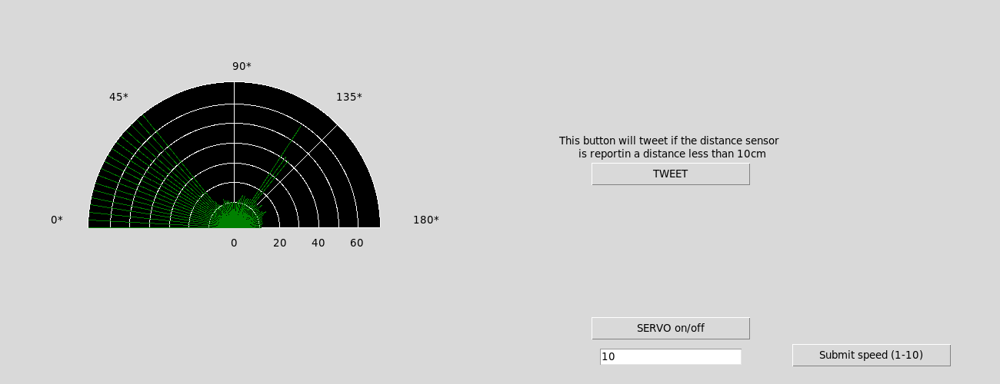
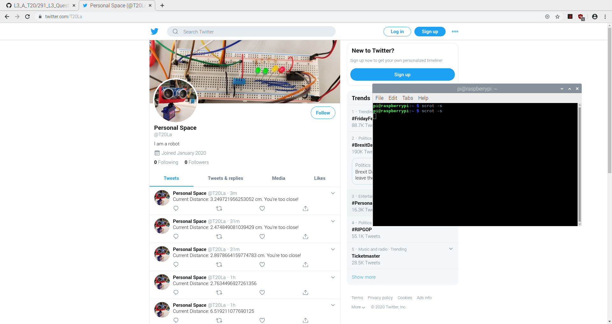

# UltraSonic-Sensor-Robot
Welcome to my Raspberry Pi 4 UltraSonic Sensor Twitter Bot that was developed by my team for UBC's Computer Engineering Design course.

Overview:
- The purpose of the project was to incorporate an ultrasonic sound sensor to read distance off objects around the Raspberry Pi and display
this information in a Radar style GUI
- Additional features were added to make the GUI standout and to have a working Twitter API tweet relevent distance information

Features:
- Raspberry Pi 4 GPIO with servo, ultrasonic sensor, and an LED shifter for displaying distance via LEDs
- Adafruit libraries
- Tkinter GUI
- Twitter API functionality

Usage and Details:
- The program runs and the servo scans 180 degrees and reports distance values on a radar in the GUI
- If a value is below a certain threshold, the Twitter API would tweet out that something is too close! and the distance
- Active LED's on the breadboard will light up depending on the distance it has reported, further the distance, more LEDs light up

Images:
Program Running with sensor data being shown

Twitter API Hard at work

Credits:
- Thanks to wkk0407 and GradyThompson for being amazing teammates and for working day and night on making the GUI so spectacular and making
the functionality so wonderful. 3 am pizza parties :)
